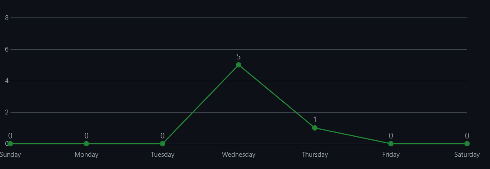
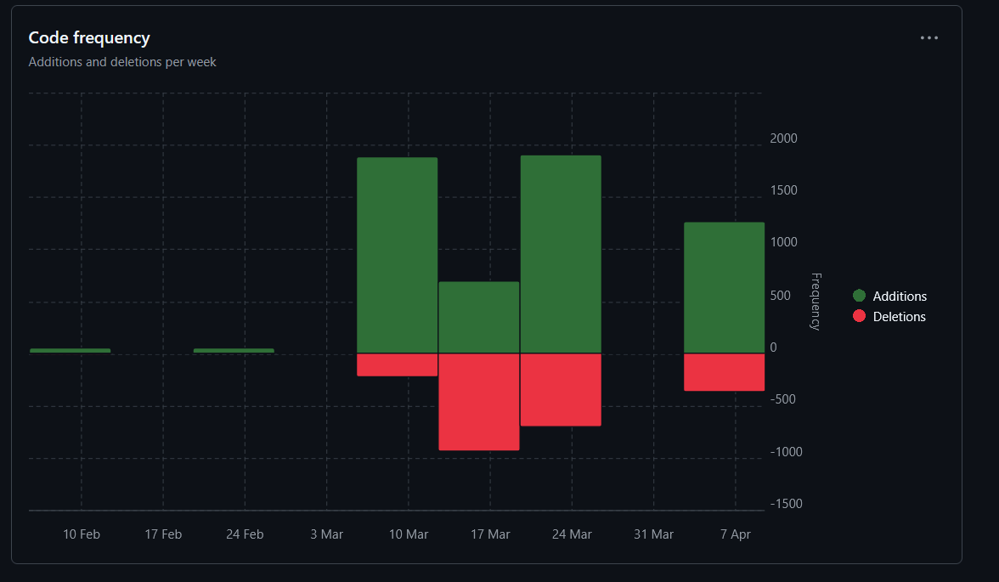

# Dritter Sprint

### Jujutsu Kognien
### Benjamin Huskic-Santic
### 2CHITM 
### [Link zum Repo](https://github.com/htl-leo-medtwt-projects/2425-sommerprojekt-2chitm-BenjaminH-S) 

## Änderungen seit dem letzten Sprint 

**World-Unterseite**
- World Unterseite wurde komplett umgesetzt und ist komplett funktionsfähig seitens Kontrastsetzung und Sprachübersetzung

**Kontrast-Modis**
- Die Bugs von den anderen Unterseiten bzgl. des Kontrasts wurden aufgehoben und sind voll funktionsfähig

## Screenshots der verrichteten Arbeit

**Commits-Insight**

**Code-Frequency**

## Ziele bis zum nächsten Sprint 
- [ ] Story Unterseite umsetzen
- [ ] Neue Library finden und einsetzen 