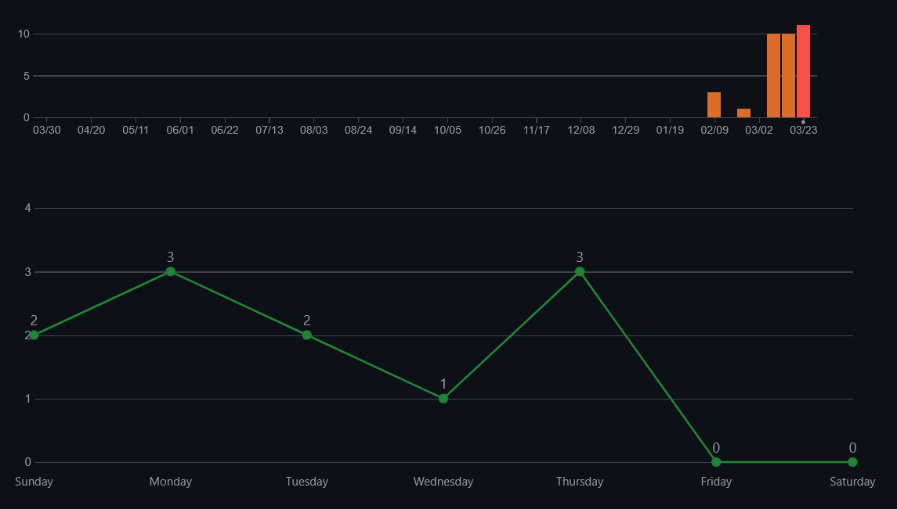
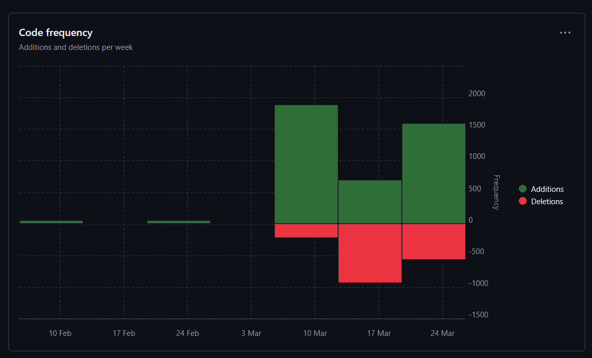

# Erster Sprint

### Jujutsu Kognien
### Benjamin Huskic-Santic
### 2CHITM 
### [Link zum Repo](https://github.com/htl-leo-medtwt-projects/2425-sommerprojekt-2chitm-BenjaminH-S) 

## Änderungen seit dem letzten Sprint 

**Figma-Prototype**
- Das Figma wurde noch überarbeitet, um zu realisieren, wie die Story ausschauen soll

**Ordnerstruktur**
- Es wurden endlich den einzelnen Unterseiten ihre Javascript-Dateien hinzugefügt, nachdem die Kontrast- und Spracheinstellungen auf der Main-Seite erfolgreich implementiert wurden

## Screenshots der verrichteten Arbeit

**Commits-Insight**

**Code-Frequency**

## Ziele bis zum nächsten Sprint 

- [ ] World-Unterseite vollständig aufbauen 
- [ ] Observer-API in derselben Unterseite einbinden 