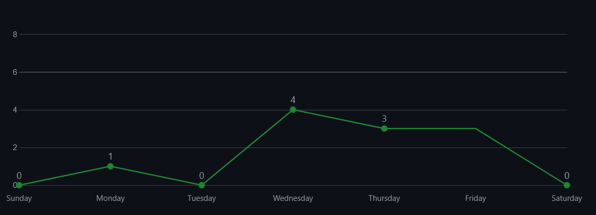
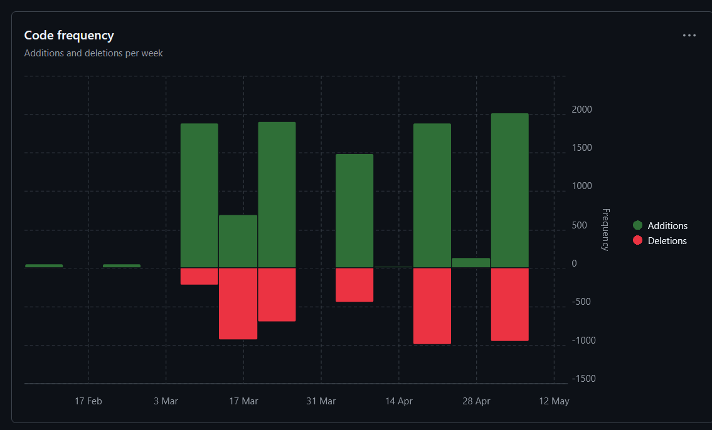

# Fünfter Sprint

### Jujutsu Kognien
### Benjamin Huskic-Santic
### 2CHITM 
### [Link zum Repo](https://github.com/htl-leo-medtwt-projects/2425-sommerprojekt-2chitm-BenjaminH-S) 
### [Link zum Canva](https://www.canva.com/design/DAGpVBeUSoI/pGe7dga7sqJ0BHLEd4orfA/edit?utm_content=DAGpVBeUSoI&utm_campaign=designshare&utm_medium=link2&utm_source=sharebutton)

## Änderungen seit dem letzten Sprint 

**Media-Unterseite**
- Man kann einzelne, kurze (aufgrund der Datenbegrenzung) Clips anschauen per Auswahl
- Switchen zwischen Season 1, Season 2 und Film 
- Schwarz/Weiß Modus implementiert 

**Main-Überseite**
- Bietet klare Übersicht zum Projekt

## Screenshots der verrichteten Arbeit

**Commits-Insight**

**Code-Frequency**

