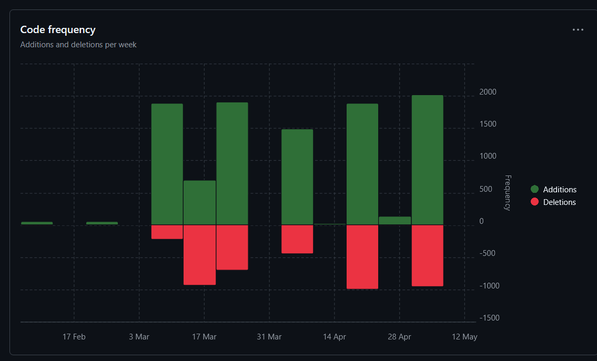

# Vierter Sprint

### Jujutsu Kognien
### Benjamin Huskic-Santic
### 2CHITM 
### [Link zum Repo](https://github.com/htl-leo-medtwt-projects/2425-sommerprojekt-2chitm-BenjaminH-S) 

## Änderungen seit dem letzten Sprint 

**FunHub-Unterseite**
- Die Quiz Unterseite wurde erfolgreich zu einer FunHub Unterseite umgeschrieben, welche unter anderem:
- Quiz mit 4 Versionen 
- Techniken-Generator
- Quoten-Zuordner mit 4 Versionen
- Kleines Memory 
- Mit der englisch-deutsch Übersetung

besitzt.

## Screenshots der verrichteten Arbeit

**Commits-Insight**

**Code-Frequency**

## Ziele bis zum nächsten Sprint 
- [] Media Unterseite einbinden und noch dazu die Main Seite